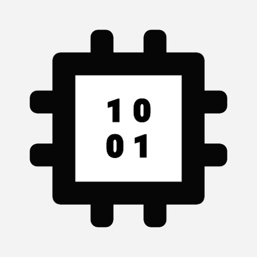
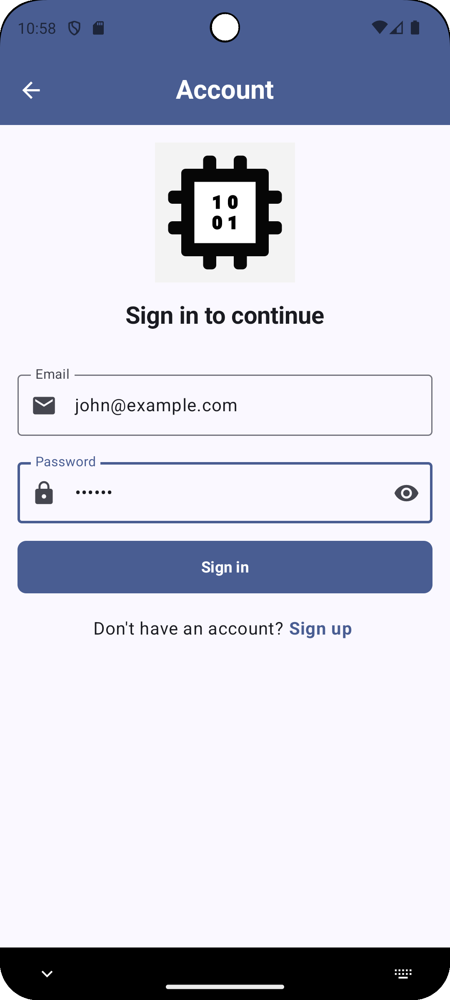
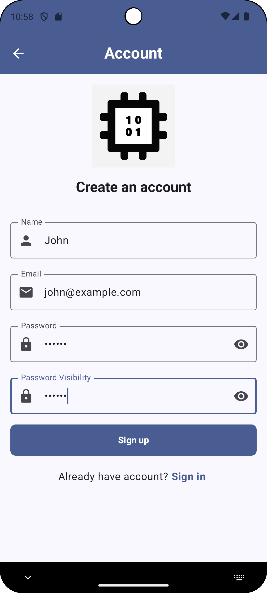
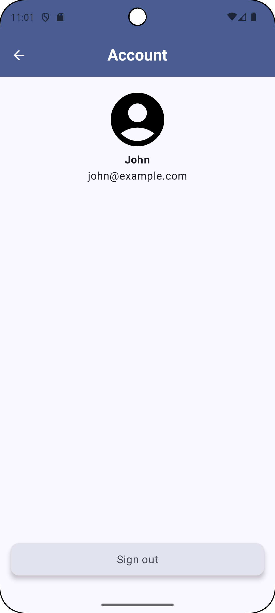
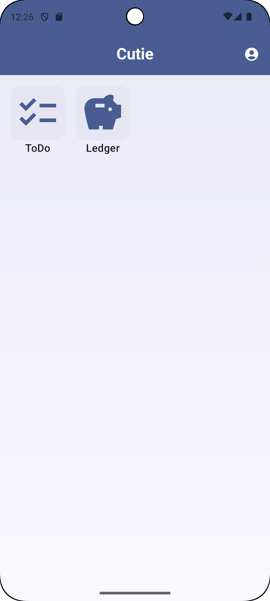
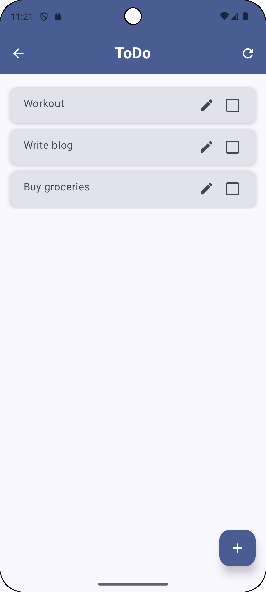
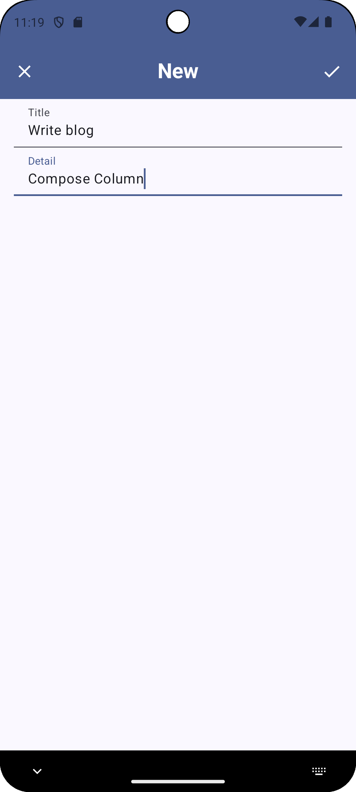
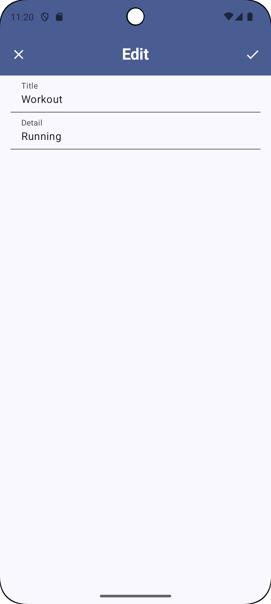

# Cutie

🇺🇸 [English](README.md) 🇨🇳 [中文](./README.zh.md)

    

 

ソフトウェア開発のベストプラクティスをデモするための多目的アプリになります。UI/UX、アーキテクチャ、通知、ナビゲーション、権限管理、並行処理、テスト、CI/CD、データベース、クラウドサービス、AIなどのテーマが含まれます。

...AND THAT APP OF THE COMMUNITY, BY THE COMMUNITY, FOR THE COMMUNITY, SHALL NOT PERISH FROM THE INTERNET.

## 📄 概要

- core - コアコンポーネント
- navigation - ナビゲーションを処理
- logging - ログ機能
- home - ベース画面
- account - 認証機能 （例えば、 ログイン、登録）
- todo - タスク管理機能
- ledger - 家計簿機能

## 📷 スクリーンショット

|ログイン|登録|アカウント|ホーム|タスク一覧|新規タスク|タスクを編集|家計簿|
|---|---|---|---|---|---|---|---|
|||||||||

## ⚙️ アーキテクチャ

- Android推奨アーキテクチャ
  - UIレイヤ - 画面表示、ユーザーの操作を処理
    - MVVM
  - Domainレイヤ - ビジネスロジック
  - Dataレイヤ - アプリデータをアプリの他の部分に公開
    - Repositoryパターン
    - 単方向データフロー (UDF)
  - 依存関係挿入 (DI)
- 機能ごとにコンポーネントをパッケージ化

## 🛠️ 技術

- ChatGPT, DeepSeek, Grok - 生成AIチャットボット
- Git
- Android Studio
- ADB
- Kotlin
- AndroidX Library
- Navigation Component
- Jetpack Component
- Jetpack Compose
- Material Design 3
- Material Symbols/Icons
- Accessibility
- Gradle
- KTS
- KSP
- ProGuard
- Hilt
- Kotlin Serialization
- Coroutine
- Flow
- JUnit
- GMS
- Firebase
  - Authentication
  - Firestore
  - Analytics
  - Crashlytics
  - Performance
- Timber

## License

Copyright 2025 RandX

Licensed under the Apache License, Version 2.0 (the "License");
you may not use this file except in compliance with the License.
You may obtain a copy of the License at

    http://www.apache.org/licenses/LICENSE-2.0

Unless required by applicable law or agreed to in writing, software
distributed under the License is distributed on an "AS IS" BASIS,
WITHOUT WARRANTIES OR CONDITIONS OF ANY KIND, either express or implied.
See the License for the specific language governing permissions and
limitations under the License.
