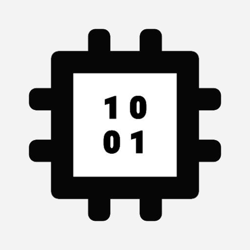
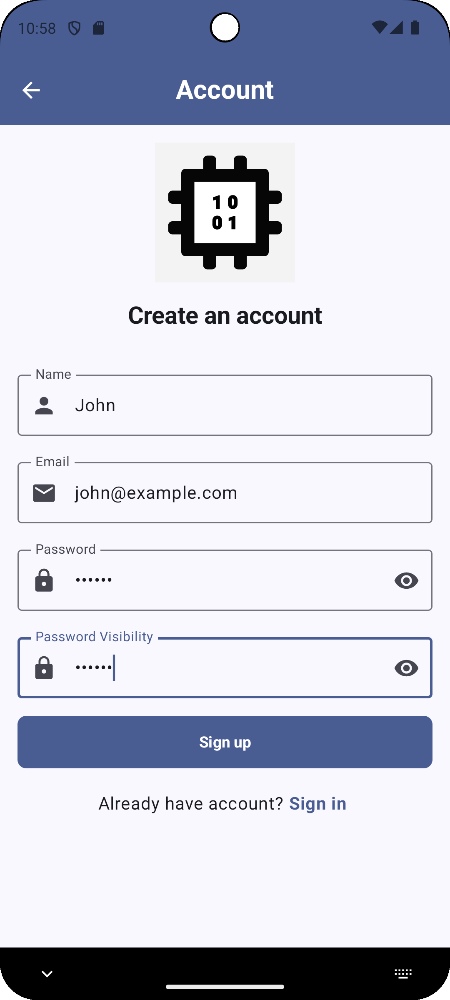
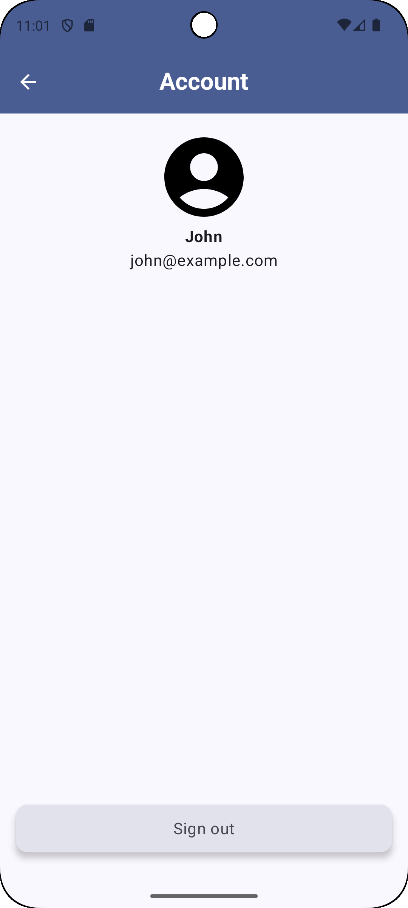
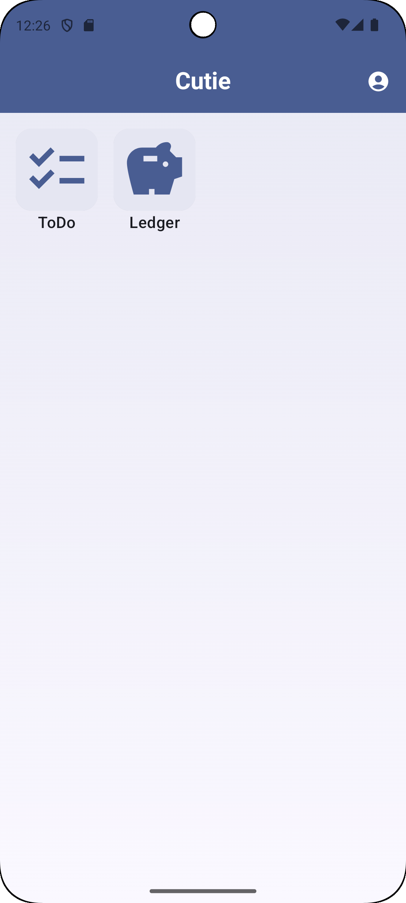
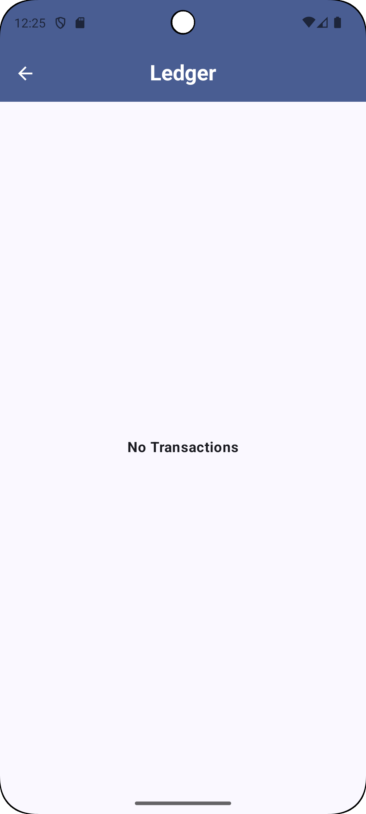

    

# Cutie

🇯🇵 [日本語](./README.ja.md) 🇨🇳 [中文](./README.zh.md)

A general-purpose app demonstrating software development best practices. Including but not limited to UI/UX, Architecture, Notification, Navigation, Permission, Concurrency, Testing, CI/CD, Database, Cloud Services and AI.

...AND THAT APP OF THE COMMUNITY, BY THE COMMUNITY, FOR THE COMMUNITY, SHALL NOT PERISH FROM THE INTERNET.

## 📄 Overview

- core - core components
- navigation - handle navigation
- logging - logger feature
- home - base screen for other feature
- account - user auth feature e.g. login, sign up
- todo - task management feature
- ledger - household account book feature

## 📷 Screenshot

|||||||||
|-|-|-|-|-|-|-|-|
|||||||||

## ⚙️ Architecture

- Android recommended architecture
  - UI layer - displays UIs, reacts to user actions
    - MVVM
  - Domain Layer - business logic
  - Data Layer - exposes data to the rest o the app
    - Repository pattern
    - Unidirectional Data Flow (UDF)
  - Dependency Injection (DI)
- Package component by feature

## 🛠️ Tech Stack

- ChatGPT, DeepSeek, Grok - Generative AI chatbots
- Git
- Android Studio
- ADB
- Kotlin
- AndroidX Library
- Navigation Component
- Jetpack Component
- Jetpack Compose
- Material Design 3
- Material Symbols/Icons
- Accessibility
- Gradle
- KTS
- KSP
- ProGuard
- Hilt
- Kotlin Serialization
- Coroutines
- Flow
- JUnit
- GMS
- Firebase
  - Authentication
  - Firestore
  - Analytics
  - Crashlytics
  - Performance
- Timber

## License

Copyright 2025 RandX

Licensed under the Apache License, Version 2.0 (the "License");
you may not use this file except in compliance with the License.
You may obtain a copy of the License at

    http://www.apache.org/licenses/LICENSE-2.0

Unless required by applicable law or agreed to in writing, software
distributed under the License is distributed on an "AS IS" BASIS,
WITHOUT WARRANTIES OR CONDITIONS OF ANY KIND, either express or implied.
See the License for the specific language governing permissions and
limitations under the License.
