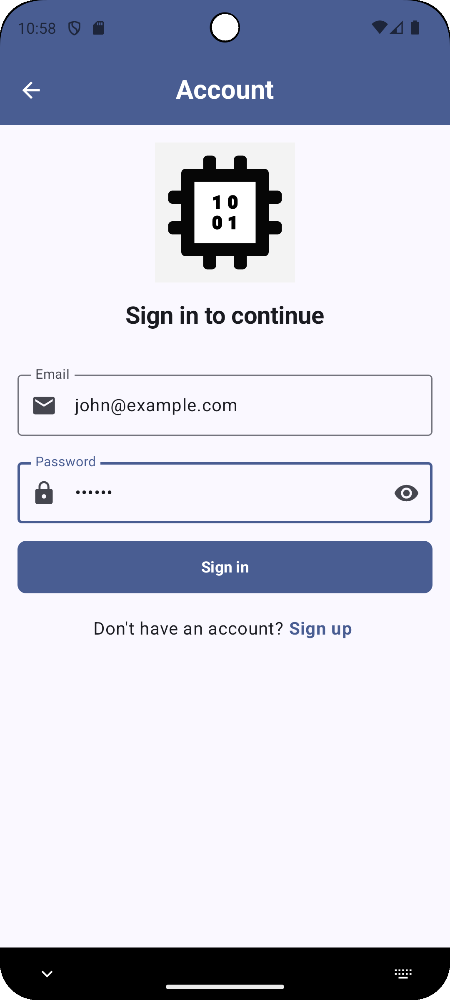
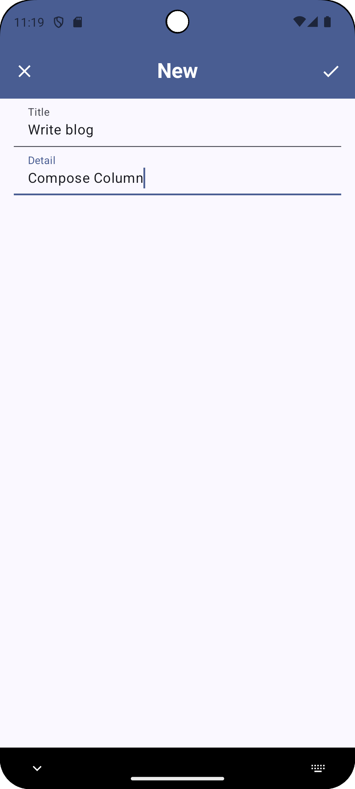

    

# Cutie

🇺🇸 [English](README.md) 🇯🇵 [日本語](./README.ja.md)

一款通用App，用来展示软件开发的最佳实践。包括但不限于UI/UX、架构、通知、导航、权限、并发、测试、CI/CD、数据库、云服务和 AI。

...AND THAT APP OF THE COMMUNITY, BY THE COMMUNITY, FOR THE COMMUNITY, SHALL NOT PERISH FROM THE INTERNET.

## 📄 简介

- core - 核心组件
- navigation - 处理画面导航
- logging - 日志功能
- home - 应用初始画面
- account - 认证功能（例如：登录，注册）
- todo - 任务管理功能
- ledger - 账本功能

## 📷 Screenshot

|||||||||
|-|-|-|-|-|-|-|-|
|||||||||

## ⚙️ Architecture

- Android推荐架构
  - UI层 - 显示画面，处理用户操作
    - MVVM
  - Domain层 - 业务逻辑
  - Data层 - 向应用的其余部分公开应用数据
    - Repository模式
    - 遵循单向数据流 (UDF)
  - 依赖注入 (DI)
- 按功能封装组件

## 🛠️ Tech Stack

- ChatGPT, DeepSeek, Grok - 生成式AI聊天机器人
- Git
- Android Studio
- ADB
- Kotlin
- AndroidX Library
- Navigation Component
- Jetpack Component
- Jetpack Compose
- Material Design 3
- Material Symbols/Icons
- Accessibility
- Gradle
- KTS
- KSP
- ProGuard
- Hilt
- Kotlin Serialization
- Coroutines
- Flow
- JUnit
- GMS
- Firebase
  - Authentication
  - Firestore
  - Analytics
  - Crashlytics
  - Performance
- Timber

## License

Copyright 2025 RandX

Licensed under the Apache License, Version 2.0 (the "License");
you may not use this file except in compliance with the License.
You may obtain a copy of the License at

    http://www.apache.org/licenses/LICENSE-2.0

Unless required by applicable law or agreed to in writing, software
distributed under the License is distributed on an "AS IS" BASIS,
WITHOUT WARRANTIES OR CONDITIONS OF ANY KIND, either express or implied.
See the License for the specific language governing permissions and
limitations under the License.
